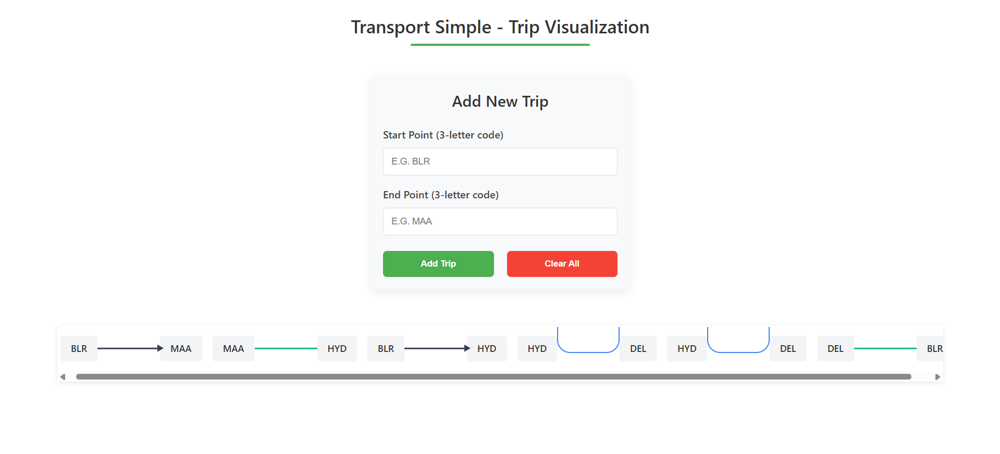

# Trip Visualization ✈️

 <!-- Add screenshot showing levels -->

An Angular application that visualizes transport routes with multi-level path grouping as per the assignment specifications.


### Core Functionality
- **Input Fields**:
  - Start Point (3-character code)
  - End Point (3-character code)
  **Example**
  - Start: BLR (Bangalore)
  - End: MAA (Chennai)
 
  
- **Visualization Rules**:
  - **Level 1 (Primary Route)**:
    - Straight line with arrow for non-continued trips
    - Green solid line for continued trips (when trip end matches next start)
  - **Level 2 (Duplicate Routes)**:
    - Blue curved lines for consecutive identical trips
    - Indented below primary routes

### Technical Specifications
- Dynamic rendering of unlimited trips
- Responsive layout adapting to any number of routes
- Clean separation of concerns (components/services)

## Solution Implementation 🛠️

### Architecture
```mermaid
graph TD
    A[TripInputComponent] -->|Emits| B(TripService)
    B -->|Updates| C[TripVisualizationComponent]
    C --> D{Level Detection}
    D -->|Continued| E[Level 1 - Green Line]
    D -->|New Route| F[Level 1 - Arrow Line]
    D -->|Duplicate| G[Level 2 - Curved Line]


### Add sample routes

    BLR → MAA (Level 1 with arrow)
    MAA → HYD (Level 1 continued - green line)
    BLR → HYD (Level 1 with arrow)
    HYD → DEL (Level 2 curved - duplicate)
    HYD → DEL (Level 2 curved - duplicate)
    DEL → BLR (Level 1 with arrow)